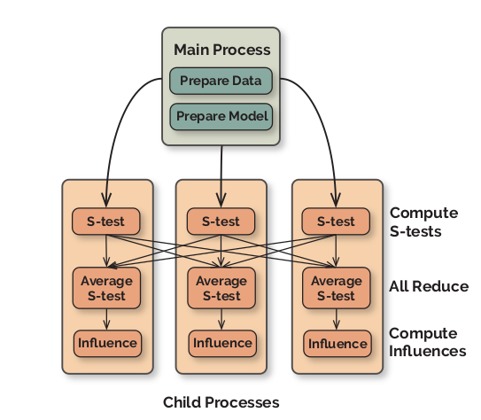


{{ if or .Page.Params.math .Site.Params.math }}

<!-- KaTeX -->
<link rel="stylesheet" href="https://cdn.jsdelivr.net/npm/katex@0.11.1/dist/katex.min.css" integrity="sha384-zB1R0rpPzHqg7Kpt0Aljp8JPLqbXI3bhnPWROx27a9N0Ll6ZP/+DiW/UqRcLbRjq" crossorigin="anonymous">

{{ end }}

In this article, I review about Influence functions and various of its - a classic technique from robust statistics - to trace a model's prediction through the learning algorithm and back to its training data, thereby identifying training points most responsible for a given prediction.
# Basics of influence function

Consider a prediction problem from some input space \(\mathcal{X}\) (e.g., images, text,\(\ldots\)) to an output space \(\mathcal{Y}\) (e.g,. labels). We are given training points \(z_1,\ldots,z_n\), where \(z_i=(x_i,y_i) \in \mathcal{X} \times \mathcal{Y}\). For a point \(z\) and parameters \(\theta \in \Theta\), let \(L(z, \theta)\) be the loss, and let \(\frac{1}{n} \sum_{i=1}^n L(z_i, \theta)\) be the empirical risk. The empirical risk minimizer is given by 
$$
    \hat{\theta} \stackrel{\text { def }}{=} \arg \min _{\theta \in \Theta} \frac{1}{n} \sum_{i=1}^{n} L\left(z_{i}, \theta\right)
$$

Assume that the empirical risk is twice-differentiable and strictly convex in \(\theta\). Our goal is to understand the effect of training points on a model's predictions.

## Up-weighting a training point

Up-weighting a training example \(z\) by an infinitesimal amount \(\epsilon\) leads to a new set of model parameters denoted by \(\hat{\theta}_{\epsilon, z}\). This set of new model parameters \(\hat{\theta}_{\epsilon, z}\) is obtained by solving:
$$
    \hat{\theta}_{\epsilon, z} \stackrel{\text { def }}{=} \arg \min _{\theta \in \Theta} \frac{1}{n} \sum_{i=1}^{n} L\left(z_{i}, \theta\right)+\epsilon L(z, \theta)
$$
Removing a training point \(z\) is similar to up-weighting its corresponding weight by \(\epsilon = \frac{-1}{n}\) in below equation. The main idea used is to approximate \(\hat{\theta}_{\epsilon, z}\) by the first-order Taylor series expansion around the optimal model parameters represented by \(\theta^{*}\), which leads to:
$$
    \hat{\theta}_{\epsilon, z} \approx \theta^{*} - \epsilon H_{\hat{\theta}}^{-1} \nabla_{\theta} L(z, \hat{\theta})
$$
where \(H_{\hat{\theta}} \stackrel{\text { def }}{=} \frac{1}{n} \sum_{i=1}^{n} \nabla_{\theta}^{2} L\left(z_{i}, \hat{\theta}\right)\) is the Hessian and is positive definite (PD) by assumption.


Following the result in <cite>Pang Wei Koh and Percy Liang[^1]</cite>, the change in the model parameters (\(\Delta\theta = \hat{\theta}_{-z} - \hat{\theta} \approx - \frac{1}{n} \mathcal{I}_{\text {up,params }} (z)\):
$$
    \left.\mathcal{I}_{\text {up,params }}(z) \stackrel{\text { def }}{=} \frac{d \hat{\theta}_{\epsilon, z}}{d \epsilon}\right|_{\epsilon=0}=-H_{\hat{\theta}}^{-1} \nabla_{\theta} L(z, \hat{\theta})
$$
The change in the loss value for a particular test point \(z_t\) when a training point $z$ is up-weighted can be approximated as a closed-form expression by the chain rule:
$$
\begin{aligned}
    \mathcal{I}_{\text {up,loss }}\left(z, z_{\text {test }}\right) &\left.\stackrel{\text { def }}{=} \frac{d L\left(z_{\text {test }}, \hat{\theta}_{\epsilon, z}\right)}{d \epsilon}\right|_{\epsilon=0} \\
    &=\left.\nabla_{\theta} L\left(z_{\text {test }}, \hat{\theta}\right)^{\top} \frac{d \hat{\theta}_{\epsilon, z}}{d \epsilon}\right|_{\epsilon=0} \\
    &=-\nabla_{\theta} L\left(z_{\text {test }}, \hat{\theta}\right)^{\top} H_{\hat{\theta}}^{-1} \nabla_{\theta} L(z, \hat{\theta}) .
\end{aligned}
$$
Below equation is approximately the change in the loss for the test-sample \(z_{\text{test}}\) when a training sample \(z\) is removed from the training set.

In addition, in the paper <cite>[^1]</cite>, the authors also introduce *Perturbing a training input*. However, it is less common than up-weighting a training point.

## Deriving the influence function \(\mathcal{I}_{\text{up, params}}\)

Recall that \(\hat{\theta}\) minimizes the empirical risk:
$$
    R(\theta) \stackrel{\text { def }}{=} \frac{1}{n} \sum_{i=1}^{n} L\left(z_{i}, \theta\right)
$$
We further assume that \(R\) is twice-differentable and strongly convex in \(\theta\), i.e:
$$
    H_{\hat{\theta}} \stackrel{\text { def }}{=} \nabla^{2} R(\hat{\theta})=\frac{1}{n} \sum_{i=1}^{n} \nabla_{\theta}^{2} L\left(z_{i}, \hat{\theta}\right)
$$
exits and is positive definite. This guarantees the existence of \(H_{\hat{\theta}}^{-1}\), which we will use in the subsequent derivation.

The perturbed parameters \(\hat{\theta}_{\epsilon, z}\) can be written as:
$$
    \hat{\theta}_{\epsilon, z}=\arg \min _{\theta \in \Theta}\{R(\theta)+\epsilon L(z, \theta)\}
$$
Define the parameter change \(\Delta_{\epsilon} = \hat{\theta}_{\epsilon,z} - \hat{\theta}\), and note that, as \(\hat{\theta}\) doesn't depend on \(\epsilon\), the quantity we seek to compute can be written in terms of it:
$$
    \frac{d \hat{\theta}_{\epsilon, z}}{d \epsilon}=\frac{d \Delta_{\epsilon}}{d \epsilon}
$$
Since \(\hat{\theta}_{\epsilon, z}\) is a minimizer of bellow equation, let us examine its first-order optimality conditions:
$$
    0=\nabla R\left(\hat{\theta}_{\epsilon, z}\right)+\epsilon \nabla L\left(z, \hat{\theta}_{\epsilon, z}\right)
$$
Next, since \(\hat{\theta}_{\epsilon, z} \to \hat{\theta}\) as \(\epsilon \to 0\), we perform a Taylor expansion of the right-band side:
$$
    \begin{aligned}
    0 \approx &[\nabla R(\hat{\theta})+\epsilon \nabla L(z, \hat{\theta})]+\\
    &\left[\nabla^{2} R(\hat{\theta})+\epsilon \nabla^{2} L(z, \hat{\theta})\right] \Delta_{\epsilon}
    \end{aligned}
$$
where we have dropped \(o\left(\left\|\Delta_{\epsilon}\right\|\right)\) terms.

Solving for \(\Delta_{\epsilon}\), we get:
$$
    \begin{array}{c}
\Delta_{\epsilon} \approx-\left[\nabla^{2} R(\hat{\theta})+\epsilon \nabla^{2} L(z, \hat{\theta})\right]^{-1} \\
{[\nabla R(\hat{\theta})+\epsilon \nabla L(z, \hat{\theta})]}
\end{array}
$$
since \(\hat{\theta}\) minimizes \(R\), we have \(\nabla R(\hat{\theta})=0\). Dropping \(o(\epsilon)\) terms, we have:
$$
    \Delta_{\epsilon} \approx-\nabla^{2} R(\hat{\theta})^{-1} \nabla L(z, \hat{\theta}) \epsilon
$$
So, we conclude that:
$$
    \begin{aligned}
\left.\frac{d \hat{\theta}_{\epsilon, z}}{d \epsilon}\right|_{\epsilon=0} &=-H_{\hat{\theta}}^{-1} \nabla L(z, \hat{\theta}) \\
& \stackrel{\text { def }}{=} \mathcal{I}_{\text {up,params }}(z)
\end{aligned}
$$

# Efficiently calculating influence
## Hessian-vector products

It is not easy and expensive to compute the matrix \(H_{\theta}^{-1}\) directly. We can use Hessian-vector products (HVPs) to efficiently approximate \(s_{\text {test }} \stackrel{\text { def }}{=} H_{\hat{\theta}}^{-1} \nabla_{\theta} L\left(z_{\text {test }}, \hat{\theta}\right)\) and then compute \(\mathcal{I}_{\text {up,loss }}\left(z, z_{\text {test }}\right)=-s_{\text {test }} \cdot \nabla_{\theta} L(z, \hat{\theta})\). With \(s_{\text{test}}\), we can recursively compute the following:
$$
    \left\{
    \begin{matrix}
        H^{-1}_{0} v = v \\ 
    	H_j^{-1}v  = v + (I-\nabla^2_{\theta} L(z_{s_j}, \hat{\theta})) H_{j-1}^{-1}v 
	  \end{matrix}
	\right.
$$
Initialization: \(v = \nabla_{\theta} L(z_{test}, \hat{\theta})\), the \(z_{s_j}\) points are randomly taken from the training set. Equation equivalent:
$$
    \left\{
    \begin{matrix}
        H^{-1}_{0} v = v \\ 
    	H_j^{-1}v = v + IH_{j-1}^{-1}v - \nabla^2_{\theta} L(z_{s_j}, \hat{\theta}) H_{j-1}^{-1}v
	  \end{matrix}
	\right.
$$
The third component of the bellow equation is equivalent to calculating \(\mathbf{Hv}\) where: \(\mathbf{H}=\nabla^2_{\theta} L(z_{s_j}, \hat{\theta})\) and \(\mathbf{v}=H_{j-1}^{-1}v\). In <cite>Heterogeneous uncertainty sampling for supervised learning[^2]</cite>, we have:

$$
    \mathbf{H} \mathbf{v}=\nabla_{\mathbf{\theta}}\left(\mathbf{v} \cdot \nabla_{\mathbf{\theta}} L\right)
$$

In influence function calculated as above, cost and approximation quality depends:
- **J**: the number of recursive iterations.
- **T**: the number of independent runs.
- **B**: the batch size of sample points from training data (Number of \(z_{s_j}\) ).
To improve the speed of influence function, the paper <cite>Fastif: Scalable influence functions for efficient model interpretation and debugging [^3]</cite> suggest some ideas such as: Speeding up the argmax using *kNN, Speeding up the Inverse Hessian, Parallelization*.
## Speeding up the argmax using kNN

With the influence function, we need to calculate influence on the full training data. 
$$
    z^{*}=\underset{z \in \mathcal{Z}}{\arg \max } \mathcal{I}\left(z, z_{\text {test }}\right)
$$
We hypothesize that we could constrain the expensive search to a subset of promising data points, \(\hat{\mathcal{Z}} \subseteq \mathcal{Z}\):
$$
    z^{*}=\underset{z \in \hat{\mathcal{Z}}}{\arg \max } \mathcal{I}\left(z, z_{\text {test }}\right)
$$
We can select subset \(\hat{\mathcal{Z}}\) as the top-k nearest neighbors of \(z_{\text{test}}\) based on the \(L_{2}\) distance between extracted features of the data-points and can use libraries such as FAISS [^4].

To evaluate, define the recall score R@m as the percentage of top-m ground-truth influential data points selected by the kNN.

    $$
        R @ m=\frac{\mid\{\text { retrieved }\} \cap\{\text { top- } m \text { influential }\} \mid}{\mid\{\text { top- } m \text { influential } \mid}
    $$

## Speeding up the Inverse Hessian
Propose a few simple changes:
    
- Choose a **J** so that approximation converges.
- Choose a small batch size. In our experiments, we found that even **B = 1** suffices.
- Make up for the noisiness of small batch size using larger **T** , which can be distributed over multiple GPUs.
## Parallelization


We can apply asynchronous parallel computation to compute the \(s_{\text{test}}\), use one synchronization point to average the result using all-reduce, and then asynchronously compute the influence of a subset of data-points that are pre-selected using kNN

# Influence functions in deep learning are fragile
The influence function method is unstable in deep learning networks. According to the theory of influence functions, they work well with convex functions. However, it is not clear for non-convex functions. In the paper <cite>Influence functions in deep learning are fragile [^5]</cite> provides comparative experiments on influence functions in networks with different depths and with different data. Experimentally, the authors concluded that:

- Influence function estimates fairly accurately when networks are shallow, not so well in deeper networks.
- Train model with weight decay \(\lambda\| \theta \|_2^2\)  into the loss function to increase accuracy.
- The accuracy of influence can vary considerably depending on the test points.

Based on theory and experiment, I see that the influence function does not work effectively with non-convex optimization problems. This is also the biggest drawback of this method.

[^1]: Pang Wei Koh and Percy Liang. “Understanding black-box predictions via influence functions”. In: International Conference on Machine Learning. 
[^2]: David D Lewis and Jason Catlett. “Heterogeneous uncertainty sampling for supervised learning”. In: Machine learning proceedings 1994. Elsevier, 1994, pp. 148–156.
[^3]: Han Guo et al. “Fastif: Scalable influence functions for efficient model interpretation and debugging”. In: arXiv preprint arXiv:2012.15781 (2020).
[^4]: Jeff Johnson, Matthijs Douze, and Herve Jegou. “Billion-scale similarity searchwith gpus”. In: IEEE Transactions on Big Data (2019).
[^5]: Samyadeep Basu, Philip Pope, and Soheil Feizi. “Influence functions in deep learning are fragile”. In: arXiv preprint arXiv:2006.14651 (2020).