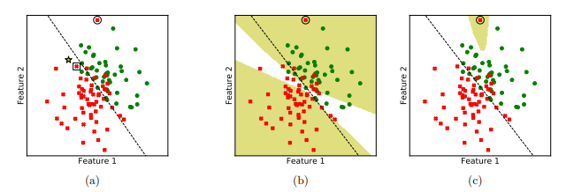
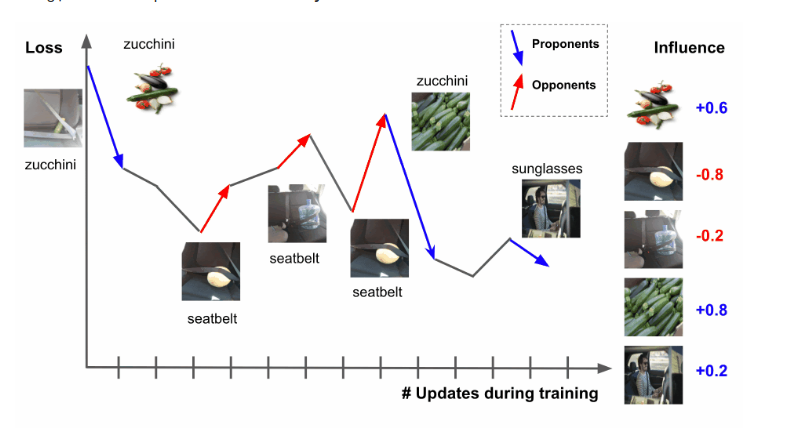


{{ if or .Page.Params.math .Site.Params.math }}

<!-- KaTeX -->
<link rel="stylesheet" href="https://cdn.jsdelivr.net/npm/katex@0.11.1/dist/katex.min.css" integrity="sha384-zB1R0rpPzHqg7Kpt0Aljp8JPLqbXI3bhnPWROx27a9N0Ll6ZP/+DiW/UqRcLbRjq" crossorigin="anonymous">

{{ end }}

> I strongly encourage you to explore my earlier article, Understanding the [Influence Function](/posts/2023-11-24-influence-function/), as it serves as a valuable foundation for comprehending the content presented in this piece.
# What is error detection problem?
The rapid growth of the internet, however, causes data to rise exponentially, posing numerous issues. Deep learning algorithms become less effective when big data is mislabeled or contains many errors. Current studies focus solely on improving the model rather than detecting data issues. Research on error tracing has not achieved high accuracy and is costly to store and compute, and is even void of stability or dependent on many different constraints and assumptions.

The model will work more accurately if the dataset is improved. Therefore, we concentrate on seeking solutions for resolving the problem of error tracing. We have a data set used to train the model, but it is enormous or requires a lot of expertise (such as in medical and engineering sectors); thus, people cannot manually check it. Besides, we will not be able to figure out how many incorrect patterns there are. Error detection problem to identify wrong data patterns in the original data set that we can modify to help improve the performance of deep learning models. The method in error dection problem must have high accuracy and fast access speed,  minimize dependence on theoretical hypotheses, and be generalizable, suited for a wide range of data and deep learning models.

In this article, I will overview an approach to the error detection problem which is gradient-based methods, of which the Influence funtion in my previous article is one of those methods.
# Representer Points
<cite>Representer Points [^1]</cite> introduced by Yeh et al to approximate the influence function of training points on a test sample. To indicate the form of a representer theorem, suppose we solve for the optimal parameters:

$$
    \theta^{*} = \underset{\theta \in \Theta}{\text{argmin}} \left\{ \frac{1}{n} \sum_i^n L(x_i,y_i, \theta) + g(\| \theta \|)  \right\}
$$
where \(g\) is non-decreasing, \(L_2\) regularized. The parameterization spliting of the model as a feature model and a prediction network:

- **Feature model:** \(\phi_2(x_i, \theta_2)\) can be arbitrarily deep, or simply the identify function.
- **Prediction network:** with parameters \(\theta_1\) is \(\phi(x_i, \theta) = \theta_1 f_i \subseteq \mathbb{R}^c\) and \(f_i = \phi_2 (x_i, \theta_2) \subseteq \mathbb{R}^f\) is the last intermedicate layer feature in the neural network for input \(x_i\).

So, we have a prediction of model is \(\hat{y}_i = \sigma\left( \phi(x_i, \theta) \right)\) and let \(g(\| \theta \|) = \lambda \| \theta_1 \|^2\). Then, we have the decomposition:
$$
    \phi(x_t, \theta^{*}) = \sum_{i}^n k(x_t, x_i, \alpha_i)
$$
where \(\alpha_{i}=\frac{1}{-2 \lambda{n}} \frac{\partial \mathcal{L}\left(x_{i}, y_{i}, \theta\right)}{\partial \phi\left(x_{i}, \theta\right)}\) and \(k(x_t, x_i, \alpha_i)=\alpha_i f_i^T f_t\), which we call a representer value for \(x_i\) given \(x_t\).

We showed that for such models the output for any target instance \(x_t\) can be expressed as a linear decomposition of “data importance” of training instances. Through this, we can evaluate when a testing point of the model predicts incorrectly which training points affect it the most, and expect that those training points are mislabeled data.



**Proof:** Note that for any stationary point, the gradient of the loss with respect to \(\theta_1\) is equal to \(0\). We therefore have:
$$
    \frac{1}{n} \sum_{i=1}^{n} \frac{\partial L\left({x}_{i}, {y}_{i}, {\theta}\right)}{\partial {\theta}_{1}}+2 \lambda {\theta}_{1}^{*}=0 \quad \Rightarrow \quad {\theta}_{1}^{*}=-\frac{1}{2 \lambda n} \sum_{i=1}^{n} \frac{\partial L\left({x}_{i}, {y}_{i}, {\theta}\right)}{\partial {\theta}_{1}}=\sum_{i=1}^{n} \alpha_{i} {f}_{i}^{T}
$$
where \(\alpha_{i}=\frac{1}{-2 \lambda{n}} \frac{\partial \mathcal{L}\left(x_{i}, y_{i}, \theta\right)}{\partial \phi\left(x_{i}, \theta\right)}\) by the chain rule. We thus have that:
$$
    \phi(x_t, \theta^{*}) = \theta_1^{*} f_t  = \sum_{i}^n k(x_t, x_i, \alpha)
$$
where \(k(x_t, x_i, \alpha_i) = \alpha_i f_i^T f_t\) by simply plugging in the two above expression.


# Gradient Dot and Gradient Cosine Similarity
These methods are introduced by Charpiat et al <cite>[^2]</cite>. Basically, these methods are based on influence function. If one wants to change the value of \(L(z, \theta)\) by a small quantity \(\epsilon\), one needs to update \(\theta\) by \(\delta \theta = \epsilon \frac{\nabla_{\theta}L(z, \theta)}{\| \nabla_{\theta} L(z, \theta) \|^2}\). Indeed, after the parameter update, the new value at \(z\) will be:

$$
    L(z, \theta + \delta \theta)(z) = L(z, \theta) + \nabla L(z, \theta) \cdot \delta \theta + O( \| \delta \theta \|) \\
    = L(z, \theta) + \epsilon + O(\epsilon^2)
$$
This parameter change induces a value change at any other point \(z'\):
$$
    L(z', \theta + \delta \theta)  = L(z', \theta) + \nabla L(z', \theta) \cdot \delta \theta +O(\| \delta \theta \|) \\
     = L(z', \theta) + \epsilon \frac{\nabla L(z', \theta) \cdot \nabla L(z, \theta)}{\| \nabla L(z, \theta) \|^2 } + O(\epsilon^2)
$$
Therefore the kernel represents the influence of $z$ over $z'$:
$$
    k_{\theta}^N (z, z') = \frac{\nabla L(z', \theta) \cdot \nabla L(z, \theta)}{\| \nabla L(z, \theta) \|^2 }
$$
Note however that \(k_{\theta}^N (x, x')\) is not symmetric. We have two symmetric kernels natural arise:

- **The inner product:** (We called it **Gradient Dot**)

$$
k_{\theta}^I (z, z') = \nabla_{\theta} L(z, \theta) \cdot \nabla L(z', \theta)
$$

- **Normalized version:** (We called it **Gradient Cosine Similarity**)

$$
k_{\theta}^C (z, z') = \frac{\nabla L(z, \theta)}{\|\nabla L(z, \theta) \| } \cdot \frac{\nabla L(z',\theta)}{\| \nabla L(z', \theta) \|}
$$
It can be seen that \(k_{\theta}^C (z, z')\) has the advantage of being bounded (in \([-1, 1]\), thus expressing similarity in a usual meaning. Interestingly, \(k_{\theta}^I\) is equivalent to the Influence function without Hessian, in <cite>An Empirical Comparison of Instance Attribution Methods for NLP [^3]</cite> experimented and concluded that this formula is roughly equivalent to influence function with Hessian.
# RelatIF method
One shortcoming of influence functions is that the training examples deemed most *influential* are ofter outliers or mislabeled, making them poor choices for an explanation. **RelatIF** <cite>[^4]</cite> is a new class of criteria for choosing relevant training examples by way of an optimization objective that places a constraint on global influence.

Above figure described binary classification by linear decision boundaries (dashed line) to illustrate the difference between IF and RelatIF. 

In figure (a), we can see that the model predicts the test input (star). As estimated by IF, the most influential training example for the prediction is an outlier (circled). Using RelatIF, the most effective training example is more typical (encased in a square). 

Figure (b) see that using IF, every test input falling within the shaded yellow region is most influenced by the same outlier (circled). Test inputs in the remaining white area are most influenced by one of 5 other high loss examples. 

Figure (c) using RelatIF, the area where test inputs are most affected by the outlier (circled) shrinks. Test inputs in the remaining region are most influenced by one of 65 other examples.

To evaluate the effect of a training example \(z_i\) on testing example \(z_{\text{test}}\), we have:
$$
    \textbf{RelatIF}(z_i, z_{\text{test}}) = \cos \left(H^{-\frac{1}{2}} \nabla_{\theta} L(z_{\text{test}}),  H^{-\frac{1}{2}} \nabla_{\theta} L(z_i) \right)
$$
where \(\cos\) is cosine similarity function.

# TracIn method
## Introduction
TracIn method <cite>[^5]</cite> introduced by Garima and Freferick Liu et al. It computes the influence of a training example on a prediction made by the model. It applies to any machine learning model trained using stochastic gradient descent or variant, agnostic architecture, domain, and task. 


The idealized notion of the influence of a particular training example \(z\) in a given test example \(z'\) is defined as the total reduction in loss on the test example \(z'\) that is induced by the training process whenever the training example \(z\) is utilized:
$$
    \text{TracInIdeal(z,z')} = \sum_{t:z_t =z} L(z', \theta_t) - L(z', \theta_{t+1})
$$
where \(\theta_t\) and \(\theta_{t+1}\) is parameters of model when using training example \(z_t\) with SGD to updating from \(\theta_t\) to \(\theta_{t+1}\). Suppose the initial parameter vector before starting the training process is \(\theta_0\), and the final parameter vector is \(\theta_T\). The iterative optimization technique operates on one training example at a time. Then:
$$
    \sum_{i=1}^n \text{TracInIdeal}(z_i,z') = L(z', \theta_0) - L(z', \theta_T)
$$



Let:
- **Proponents:** Training samples that have positive value to influence score (reducing loss). Or so-called helpful/excitatory samples.
- **Opponents:** Training samples that have negative value to influence score (increase loss). Or so-called harmful/inhibitor samples

## First-order Approximation to Idealized Influence

We can approximate the change in the loss:
$$
    L(z',\theta_{t+1}) = L(z',\theta_t) + \nabla L(z', \theta_t) \cdot (\theta_{t+1} - \theta_t) + O(\|\theta_{t+1} - \theta_t \|^2)
$$

Using the training point \(z_t\) at iteration \(t\), then the change in parameters:
$$
    \theta_{t+1} - \theta_t = -\eta_t \nabla L(z_t, \theta_t)
$$
where \(\eta_t\) is the step size in iteration \(t\). This formula should be changed appropriately if other optimization methods as AdaGrad, Adam, Newton,\(\ldots\\\)

Combining 2 above equations, we have:
$$
    L(z', \theta_{t}) - L(z', \theta_{t+1}) \approx \eta_t \nabla L(z',\theta_t) \cdot (\theta_{t+1} - \theta_t)
$$

The effect can be approximated for a training sample $z$ by summing the approximations over all iterations, where \(z\) is used to update the parameter.
$$
    \text{TracIn}(z, z') = \sum_{t:z_t=z} \eta_t \nabla L(z', \theta_t) \cdot \nabla L(z, \theta_t)
$$


## Extension to Minibatches

To handle minibatches of size \(b \ge 1\), we compute the influence of a minibatch on the test point \(z'\), and then take its first-order approximation: First-Order Approximation \((B_t, z') = \frac{1}{b} \sum_{z \in B_t} \eta_t \nabla L(z', \theta_t) \cdot \nabla L(z, \theta_t) \), because the gradient for the minibatch \(B_t\) is \(\frac{1}{b} \sum_{z \in B_t} \nabla L(z, \theta_t)\). Then, for each training point \(z \in B_t\), we attribute the \(\frac{1}{b} \cdot \eta_t \nabla L(z', \theta_t) \cdot \nabla L(z, \theta_t)\) portion of the influence of \(B_t\) on the test point \(z'\). Summing up over all iteratios \(t\) in which a particular training point \(z\) was chosen in \(B_t\), we arrive at the following definition of TracIn with minibatches:
$$
    \text{TracIn}(z, z') = \frac{1}{b} \sum_{t:z \in B_t} \eta_t \nabla L(z', \theta_t) \cdot \nabla L(z, \theta_t)
$$

## TracIn with Checkpoint

Suppose we have \(k\) checkpoints \(\theta_{t_1}, \theta_{t_2},\ldots,\theta_{t_k}\). We assume that between checkpoints, each training example is visited exactly once. And we use the notation \(\eta_i\) to denote the step size between checkpoints \(i-1\) and \(i\). While the first-order approximation of the influence needs the parameter vector at the specific iteration where a given training example is visited, since we don't have access to the parameter vector, we approximate it with the first checkpoint parameter vector after it. Thus, this heuristic results:
$$
    \text{TracInCP}(z,z') = \sum_{i=1}^k \eta_i \nabla L(z, \theta_{t_i}) \cdot \nabla L(z', \theta_{t_i})
$$

# Summary
Through this article, I have introduced you to gradient-based methods employed in error detection tasks. While fundamentally providing satisfactory results, these gradient-based approaches demand significant computational resources and storage capacity.

[^1]: Chih-Kuan Yeh et al. “Representer point selection for explaining deep neural networks”. In: arXiv preprint arXiv:1811.09720 (2018).
[^2]: Guillaume Charpiat et al. “Input similarity from the neural network perspective”.
In: NeurIPS 2019-33th Annual Conference on Neural Information Processing Systems. 2019.
[^3]: Pouya Pezeshkpour et al. “An Empirical Comparison of Instance Attribution Methods for NLP”. In: arXiv preprint arXiv:2104.04128 (2021).
[^4]: Elnaz Barshan, Marc-Etienne Brunet, and Gintare Karolina Dziugaite. “Relatif:Identifying explanatory training samples via relative influence”. In: International Conference on Artificial Intelligence and Statistics. PMLR. 2020, pp. 1899–1909.
[^5]: Garima Pruthi et al. “Estimating training data influence by tracing gradient descent”. In: Advances in Neural Information Processing Systems 33 (2020), pp. 19920–19930.