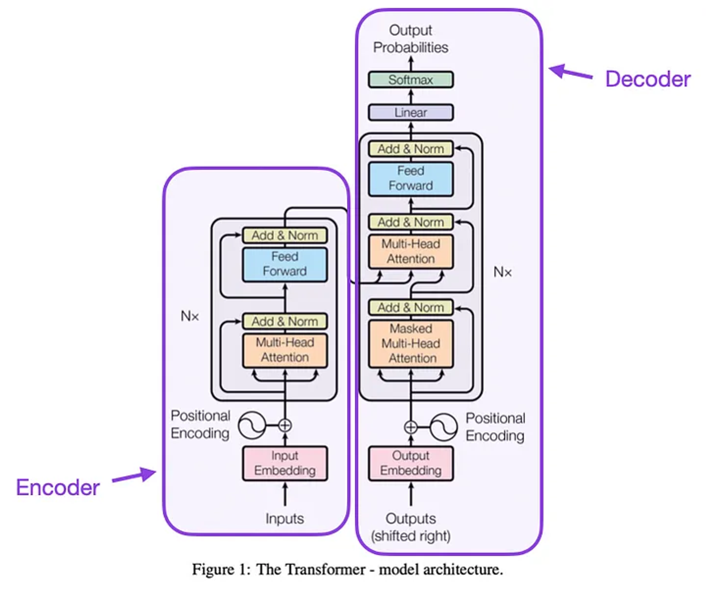
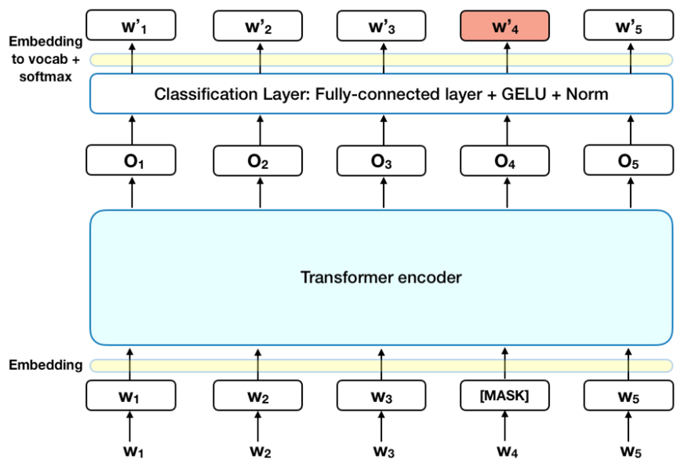
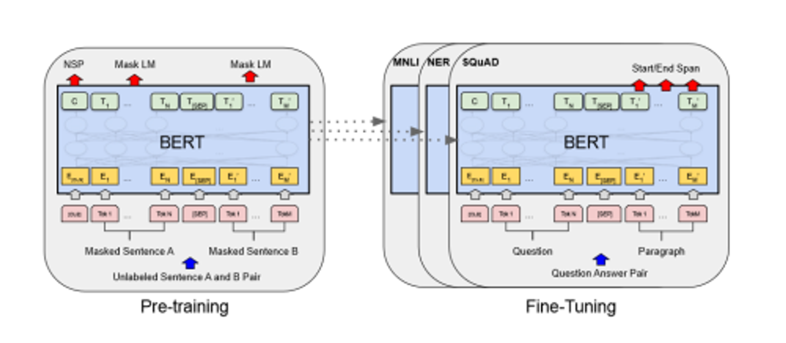
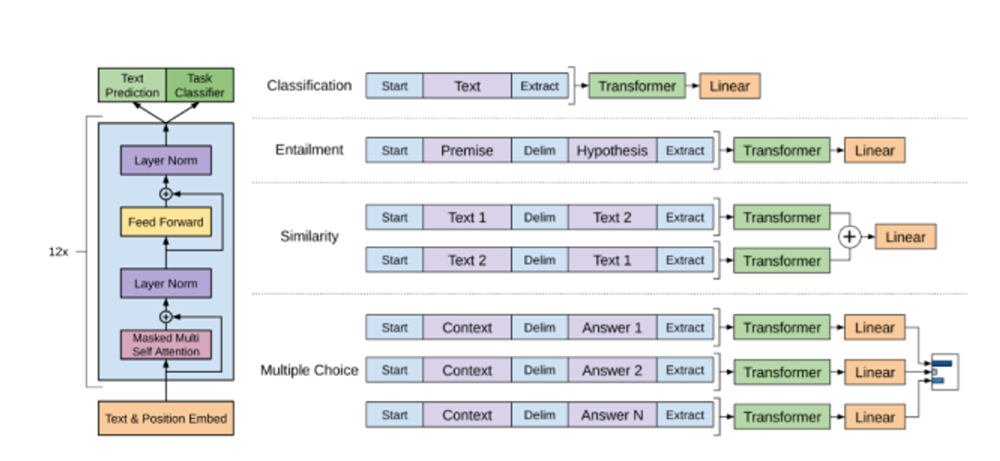
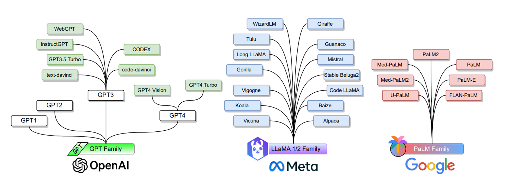
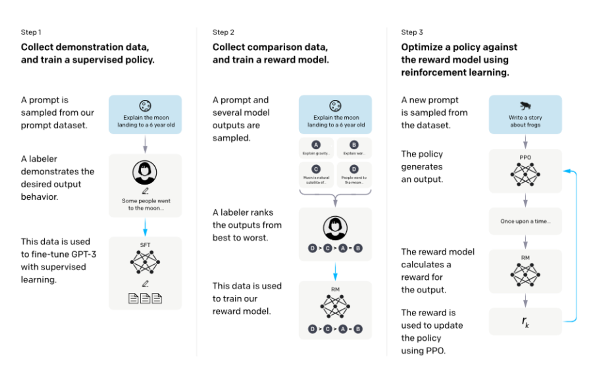
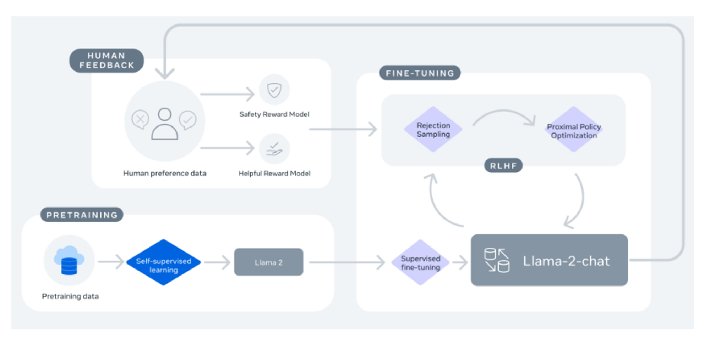
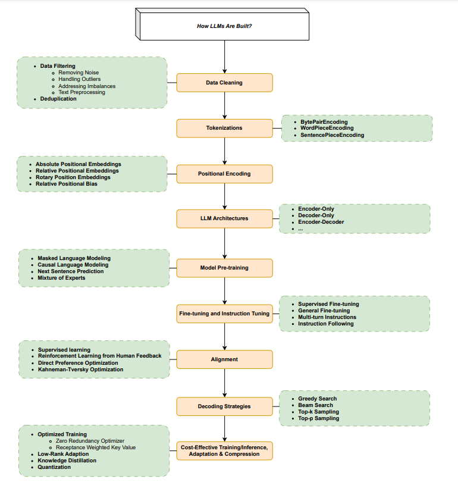

This article summarizes word knowledge from <cite>Large Language Models: A Survey [^1]</cite> . In this section, I summarize about Large Language Model Families.

# 1. Basic Architecture
The invention of the Transformer architecture marks another milestone in the development of LLM. By applying self-attention to compute in parallel for every word in a sentence of the document an “attention score” to model the influence each word has on another. Transformers allow for much more parallelization than RNNs.

Based on Transformer, we can split neural networks in LLM into 3 categories:

- Encoder-Only
- Decoder-Only
- Encoder-Decoder
## 1.1 Encoder-Only
The models only consist of an encoder network. Representative encode-only models include BERT and its variants (RoBERTa, DeBERTa, XLM, ALBERT, …)

- ***BERT** (Bidirectional Encoder Representations from Transformers)* is one of the most widely used encode-only. The pre-trained BERT can be fine-tuned for different tasks like classification, question answering…

<!-- Insert 2 images in a line -->
BERT Model                |  BERT Fine-tuning       |
|:-----------------------:|:-----------------------:|
|     |   |

BERT consists of 3 modules:

1. Embedding module: Convert input text into a sequence of embedding vectors.
2. Stack of Transformer encoders: Converts embedding vectors into contextual representation vectors.
3. Fully connected layer: Converts the representation vector (at the final layer) to one-hot vectors.

BERT training with 2 objectives.

1. Masked Language Modeling (MLM)
2. Next Sentence prediction (NSP)
- ***RoBERTa***: improves the robustness of BERT by modifying a few key hyperparameters, removing NSP, and enhanced mask decoder is used to incorporate absolute positions in the decoding
layer to predict the masked tokens in model pre-training.
- ***ALBERT*** uses 2 parameter-reduction technologies to lower memory consumption and increase the training speed of BERT:
    1. Splitting the embedding matrix into 2 smaller matrices.
    2. Using repeating layers split among groups.
- ***DeBERTa*** (Decoding enhanced BERT with disentangled attention): improve BERT and RoBERTa use 2 novel techniques:
    1. The disentangled attention mechanism: Each word is represented using 2 vectors that encode its content and position.
    2. An enhanced mask recorder is used to incorporate absolute positions in the decoding layer to predict the masked tokens in model pre-training. l adversarial training method is used for fine-tuning to improve models’ generalization.
- ***ELECTRAL***: New pre-trained task - Replaced token detection (RTD): Instead of masking the input, RDT corrupts it by replacing some tokens with plausible alternatives sampled from a small generator. Then, instead of training a model that predicts the original identities of the corrupted tokens, a discriminative model is trained to predict whether a token in the corrupted input was replaced by a generated sample or not.
- ***XLM***: Extended BERT to cross-lingual language models using 2 methods:
    1. An Unsupervised method that only relies on monolingual data.
    2. A supervised method that leverages parallel data with a new cross-lingual language model objective.

## 1.2 Decoder-Only
The most widely used decoder-only are GPT-1 and GPT-2, these models lay the foundation for more powerful LLMs subsequently (i.e. GPT-3, GPT-4).

- ***GPT-1***: (Generative Pre-Training) is a decoder-only Transformer model on diverse corpus of unlabeled text in self-supervised learning fashion, followed by discriminative fine-tuning on each specific downstream tasks.

- ***GPT-2***:  shows that language models are able to learn to perform specific natural language tasks without any explicit supervision when trained on a large WebText dataset consisting of millions of webpages. The GPT-2 model follows the model designs of GPT-1 with a few modifications:
    - Layer normalization is moved to the input of each sub-block, additional layer normalization is added after the final self-attention block.
    - Context size is increased from 512 to 1024 tokens.

## 1.3 Encoder-Decoder
The most widely used encoder-decoder are T5, mT5, MASS and BART.

- ***T5***: Text-to-Text Transfer Transformer (T5) model where transfer learning is effectively exploited for NLP via an introduction of a unified framework in which all NLP tasks are cast as a text-to-text generation task.
- ***mT5***: pre-trained on a newcommon Crawl based dataset consisting of texts in 101 languages.
- ***MASS***: MAsked Sequence to Sequence pre-training: adopts the encoder-decoder framework to reconstruct a sentence fragment given the remaining part of the sentence. The encoder takes a sentence with randomly masked fragment (several consecutive tokens) as input, and the decoder predicts the masked fragment.
- ***BART***: sequence-to-sequence translation model architecture, is a pre-trained by corrupting text with an arbitrary nosing function, and then learning to reconstruct the original text.

# 2. Large Language Model Families
In this section, I review 3 LLM families: GPT, LLaMA, PaLM.

In addition to these models, there are other popular LLMs which do not belong to those three model families,  yet they have achieved great performance and have pushed the LLMs field forward: FLAN, Gopher, T0, ERNIE 3.0, RETRO, GlaM, LaMDA, OPTChinchilla, Galactica, CodeGen, AlexaTM, Sparrow, Minerva, MoD, BLOOM, GLM, Pythia, Orca, StarCoder, Kosmos, Gemini,…
## 2.1 GPT Family
This family consists of GPT-1, GPT-2, GPT-3, InstructGPT, ChatGPT, GPT-4, CODEX, and WebGPT, developed by OpenAI.

- ***GPT-3***: is a pre-trained autoregressive language model with 175 million parameters. GPT-3 shows the emergent ability of in-context learning, which means GPT-3 can be applied to any downstream tasks without any gradient updates or fine-tuning.
- ***CodeX***:  is a general-purpose programming model that can parse natural language and generate code in response. Fine-tuned for programming applications on code corpora collected from GitHub.
- ***WebGPT***:  fine-tuned to answer open-ended questions using a text-based web browser, facilitating users to search and navigate the web. WebGPT is trained in 3 steps:
    - Firstly, WebGPT learn to  mimic human browsing behaviors using human demonstration data.
    - Secondly, a reward funtion is leared to predict human preferences.
    - Finally, WebGPT is refined to optimize the reward function via reinforcemence learning and rejction sampling.
- ***InstructGPT***: is proposed to align language models with user intent on a wide range of tasks by fune-tuning with human feedback. The method is called Reinforcement Learning from Human Feedback (RLHF).

- ***GPT-4***: is a multimodal LLM in that it can take image and text as inputs and produce text outputs.  GPT-4 was first pre-trained to predict next tokens on large text corpora, and then fine-tuned with RLHF to align model behaviors with human-desired ones.
## 2.2 LLaMA Family
LLaMA is a collection of foundation language models, released by Meta. Unlike GPT models,
LLaMA models are open-source.

- ***LLaMA***: uses the transformer architecture of GPT-3, with a few minor architectural modifications, including:
    1. Using a SwiGLU activation function instead of ReLU.
    2. Using rotary postional embeddings instead of absolute positional embedding.
    3. Using root-mean-squared layer normalization instead of standard layer nomialization.
- ***LLaMA 2***: include both foundation language models and Chat models funetuned for dialog (LLaMA-2 Chat)

- ***Alpaca***: is fune-tuned from the LLaMA-7B model using 52K instruction-following demonstations generated in style of self-instruct using GPT-3.5.
- ***Vicuna***:  fine-tuning LLaMA on user-shared conversations.
- ***Guanaco***: also finetuned LLaMA models using instruction-following data. But the funetuning a 65B done a a single 48GB GPU with QLoRA. QLoRA back-propagates gradients through a frozen, 4-bit quantized pre-trained language model into Low Rank Adapters (LoRA).
- ***Mistral-7B***: is a 7B parameter language model. . This model leverages grouped-query attention for faster inference, coupled with sliding window attention to effectively handle sequences of arbitrary length with a reduced inference cost.
## 2.3 PaLM Family
The PaLM (Pathways Language Model) family are developed by Google. It is a 540B parameter transformer-based LLM, trained on high-quality text corpus consistaning of 780 billion tokens.

- ***U-PaLM**:* models of 8B, 62B, and 540B scales arecontinually trained on PaLM with UL2R, a method of continue training LLMs on a few steps with UL2’s mixture-of-denoiser objective.
- ***PaLM-2***: is trained using a mixture of objectives. Through extensive evaluations on English, multilingual, and reasoning tasks.
- ***Med-PaLM***: is a medical questions domainm finetuned on PaLM using instruction prompt tuning, a parameter-effectient method for aligning LLMs to new domains using a few examples.

[^1]: Shervin Minaee et al. “Large Language Models: A Survey”. In: arXiv preprint arXiv:2402.06196 (2024).

# 3. How LLMs Are Built?
To build a large language model (LLM) from scratch, the process generally involves the following stages:

1. **Data Cleaning**: In this stage, we clean the data by filtering out duplicates, removing noise, and preprocessing the input data to ensure quality and consistency.

2. **Tokenization**: Tokenization is the process of breaking down text into smaller units called tokens, which can be words, phrases, symbols, or other entities, depending on the use case and processing method. Various tokenization methods include WordPiece Encoding, SentencePiece Encoding, and Byte Pair Encoding. 

3. **Positional Encoding**: This technique is used in NLP models to provide information about the positions of words in a sequence. It is especially crucial for non-sequential models like Transformers. Since Transformers do not process data in a sequential manner like RNNs or LSTMs, positional encoding is necessary to encode the positional information of words in a sequence.

4. **Choosing LLM Architectures**: Selecting the architecture for the LLM, such as Encoder-Only, Decoder-Only, or Encoder-Decoder models.

5. **Model Pre-training**: Pre-training the model using various methods, depending on the goals and architecture of the model, such as Masked Language Modeling, Causal Language Modeling, Next Sentence Prediction, and Mixture of Experts.

6. **Fine-tuning and Instruction Tuning**: This involves adjusting a pre-trained model for a specific task by training it further on a new dataset related to that task. Common methods for fine-tuning and instruction tuning include Supervised Fine-Tuning, General Fine-Tuning, Multi-Turn Instructions, and Instruction Following.

7. **Alignment**: Ensuring that the behavior of AI models aligns with the intentions and goals of users or developers. There are two main types of alignment: human alignment and task-specific alignment. Popular methods include Supervised Learning, Reinforcement Learning from Human Feedback (RLHF), Direct Preference Optimization, and KT Optimization.

8. **Decoding Strategies**: These are methods used to generate text sequences from the language model after it has been trained. The goal is to produce coherent and contextually appropriate text. Common strategies include Greedy Search, Beam Search, Top-K Sampling, and Top-P Sampling.

9. **Cost-Effective Training/Inference, Adaptation & Compression**: Optimizing costs and improving the efficiency of training and inference in LLMs, ensuring the models are scalable and deployable in cost-effective ways.

This comprehensive process ensures that the LLM is robust, efficient, and aligned with its intended use, delivering high-quality, coherent, and contextually appropriate text outputs.

 

We will explore each component in detail in the following articles.